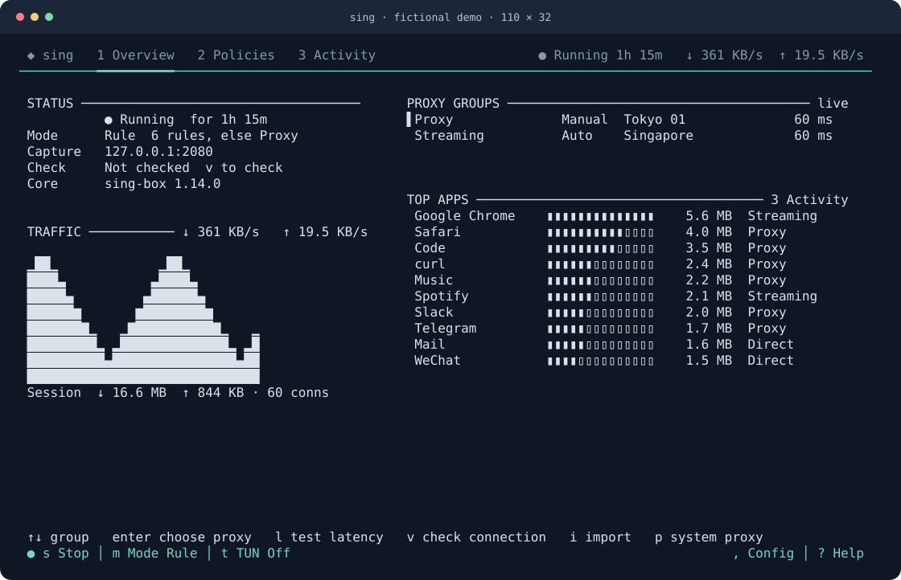

# sing

### A network proxy built in the terminal.

[](https://github.com/mmei0114/sing/actions/workflows/ci.yml)
[](https://github.com/mmei0114/sing/tree/main)
[](LICENSE)

sing brings rule-based proxying, application-aware routing and connection monitoring to the terminal. Import your subscriptions, organize proxies into groups, and decide which traffic connects directly or uses a proxy—all in a keyboard-first interface.

Powered by [sing-box](https://sing-box.sagernet.org/), with everyday controls up front and native configuration within reach. Built for macOS and Linux, at your desk or over SSH.

[Get started](#get-started) · [User guide](docs/usage.md) · [Releases](https://github.com/mmei0114/sing/releases) · [Report an issue](https://github.com/mmei0114/sing/issues/new/choose)



*Rendered from the real terminal interface with fictional demo data.*

## Your network, under your control

### Connect your way

Bring a subscription URL or node links. Preview the nodes, save them, and choose a proxy. Use a local HTTP/SOCKS proxy, macOS system proxy settings, or a TUN interface for applications that do not follow proxy settings. Switch between **Rule**, **Global** and **Direct** from the bottom bar.

### Give each connection a policy

Create manual or automatic proxy groups. Route by domain, IP range or process; send work traffic through one group and other destinations through another. Import supported Quantumult X and Clash rule lists, or use native sing-box rule sets. Conversion happens locally—no third-party conversion service is needed.

### See a connection. Fix its route.

Activity shows connections observed by the core: destinations, traffic, routing paths and application identity when available. Find a connection taking the wrong route, press `r`, and create a rule from it—or extend a compatible local rule. Inspect the change before applying it.

### Go deeper without changing tools

Press `:` for configuration organized around sing-box's own modules: DNS, inbounds, outbounds, routing and more. Object editors share the same controls; full native JSON is available for fields without dedicated forms. Saving creates a draft. **Apply** validates and loads it separately.

## Get started

This is an **early preview**, currently distributed as source. macOS Apple Silicon is locally tested; Linux builds are checked in CI. Real Linux/SSH networking and privileged System Proxy/TUN recovery still need broader testing. See [support and limits](docs/usage.md#support-and-limits).

### Build and explore

Install [Rust and Cargo](https://www.rust-lang.org/tools/install), Git, and your platform's C build tools. The tested Rust version is **1.94.0**. On macOS, use Xcode Command Line Tools; on Linux, install your distribution's C compiler/linker tools.

```sh
git clone https://github.com/mmei0114/sing.git
cd sing
cargo build --release --locked
./sing --demo
```

These steps build the latest source on `main`; tagged snapshots are available under [Releases](https://github.com/mmei0114/sing/releases). The demo needs no subscription or core, and never changes your network. Press `q` to leave it, then run `./sing` for your own setup. To install the command on your PATH instead, run `cargo install --path . --locked`.

### Make your first connection

1. **Get the core.** Press `:` → **Core**. Press `d` to fetch official releases, then `i` to open the download picker; choose a version with arrows and `Enter`. After downloading, `r` refreshes installed cores and `Enter` selects one. Compatibility is tested with **sing-box 1.14.0**, using its official gRPC API. The core is installed separately, not bundled.
2. **Bring your nodes.** Press `Esc` to return, then `i` on Overview. Paste a subscription URL, node links or a local file path. Review the preview and choose **Save to Draft**.
3. **Initialize if prompted.** On a fresh or older profile, press `s` and confirm the native configuration upgrade. This step saves a private backup and a draft; it does not start the core.
4. **Start.** Press `A`, review, then **Apply & Start**. The initial generated configuration includes a `proxy` group for your nodes; choose its live member on Overview or **Policies → Groups**. Press `m` to choose a routing mode.
5. **Send traffic through it.** On a local Mac, `p` controls System Proxy for applications that honor OS proxy settings. Otherwise configure an app to use the listener in **Config → inbounds** (normally HTTP/SOCKS at `127.0.0.1:2080`). TUN is available with `t`, but changes host routing and needs administrator access.

**Starting the core does not automatically proxy every application.** Over SSH, sing controls the remote host—not the computer you are connecting from. Avoid TUN on your only SSH connection.

Press `s` to stop proxying. **`q` only closes the interface; a running core stays active.** Existing users should follow [safe upgrade instructions](docs/usage.md#upgrade-safely), including a manager restart when upgrading from a build without the 0.6.3-dev macOS communication fix.

## Three places to work

| Workspace | Purpose |
|---|---|
| **1 Overview** | Check connection health and traffic; switch group members. |
| **2 Policies** | Organize proxy groups, ordered routing rules and subscription sources. |
| **3 Activity** | Inspect connections, observed apps and logs; correct routing. |

Left/Right change sections; Up/Down select rows. `Enter` opens and `Esc` returns. The bottom controls stay available: `s` Start/Stop · `m` Mode · `t` TUN · `:` Config · `A` Review & Apply · `?` Help.

Use an **80×24 or larger** terminal. No mouse or special icon font is required.

## A few things to know

- **Bring your own service.** sing is a proxy client, not a proxy provider or a hosted VPN service.
- **Native where it matters.** sing-box handles traffic. sing manages configuration and runtime control without requiring a Clash compatibility API. Supported foreign node subscriptions and rule lists are imported separately—not entire Clash, QX or Surge profiles.
- **Application identity has limits.** Activity describes sockets observed by the core, not every running process. Existing profiles may need `f` in Activity, followed by Apply and new connections. Shared helpers, remote clients and OS permissions can prevent attribution.
- **Know the scope.** This preview is not a packet debugger, HTTPS-decryption tool or complete system firewall. Latency checks are not bandwidth tests. Core compatibility, permissions and capture mode determine what works on each host.

## Help and contribute

The [user guide](docs/usage.md) covers groups, rule imports, DNS, application discovery, upgrades and recovery. [Open an issue](https://github.com/mmei0114/sing/issues/new/choose) with your versions and a reproducible example, or see [development instructions](docs/usage.md#development).

Never post subscription URLs, tokens, raw configurations or private traffic. Use [private vulnerability reporting](https://github.com/mmei0114/sing/security/advisories/new) for security issues; see [privacy and reporting](docs/usage.md#privacy-and-reporting).

## Credits and license

Built with [sing-box](https://github.com/SagerNet/sing-box), [Ratatui](https://github.com/ratatui/ratatui) and [Crossterm](https://github.com/crossterm-rs/crossterm). Inspired by [Surge](https://nssurge.com/)'s focus on network control and visibility, adapted for the terminal. sing is an independent project, not affiliated with SagerNet or Surge.

sing is [MIT licensed](LICENSE). The separately installed sing-box engine has its [own license](https://github.com/SagerNet/sing-box/blob/main/LICENSE).
